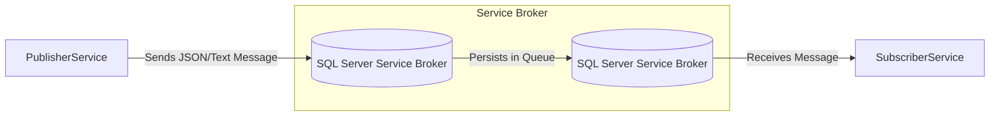

# SQL Server Service Broker - Publish / Subscribe Pattern

This project is a **.NET 8 Console Application** that demonstrates how to implement a reliable Publisher/Subscriber pattern using **SQL Server Service Broker** directly within a SQL Server database.

It provides a decoupled and highly available way to exchange messages asynchronously between applications and database instances.

---

## 🏗️ Architecture Overview

The system uses SQL Server as a message queue broker. The `.NET` console application acts as both Publisher and Subscriber:



The Console Application continuously listens for new messages via a Background Service (`HostBackgroundService`) while exposing a `PublisherService`.

---

## 🚀 Quick Start (Docker)

The fastest way to get started is by using the provided `docker-compose.yml`, which spins up a SQL Server 2017 container and the Console Application.

1. Ensure Docker and Docker Compose are installed.
2. Open a terminal in the project root.
3. Run the following command:

```bash
docker-compose up --build
```

**What happens?**
- SQL Server will start.
- The `.NET` application will start.
- On startup, the console app connects to the database and automatically configures the **Message Type, Contract, Queue, and Service** using `DatabaseConfig.StartQueue()`.
- The `HostBackgroundService` starts polling the queue for new messages.

---

## ⚙️ Manual Setup & Configuration

If you prefer to run it manually without Docker, follow these steps:

### 1. Database Setup

Ensure you have SQL Server installed (2017+).
Update the `appsettings.json` file in `ServiceBroker.ConsoleApplication` with your SQL Server credentials:

```json
{
    "ConnectionStrings": {
        "DefaultConnection": "Data Source=localhost,1433;Initial Catalog=ConsoleDatabase;User ID=sa;Password=YourSecurePassword;Integrated Security=False;TrustServerCertificate=True"
    },
    ...
}
```

### 2. Service Broker Configuration

The `appsettings.json` also holds the Service Broker nomenclature configuration:

```json
{
    "ServiceBroker":{
        "Queue": "ConsoleQueue",
        "Service": "ConsoleService",
        "Contract": "ConsoleContract",
        "MessageType": "ConsoleMessage"
    }
}
```

| Key | Description |
| ----| ----------- |
| `Queue` | The name of the table-backed SQL Queue where messages are stored. |
| `Service` | The Service Broker service name that routes messages to the queue. |
| `Contract` | Defines which message types are allowed in a conversation. |
| `MessageType` | Defines the format of the message (in this case, `VALIDATION = NONE`). |

### 3. Running the App

Run the application using the .NET CLI:

```bash
cd ServiceBroker.ConsoleApplication
dotnet run
```

---

## 🧪 Running Unit Tests

This project includes a suite of unit tests using `xUnit` and `Moq` to ensure 100% test coverage for the core application logic.

To run the tests, execute:

```bash
cd ServiceBroker.UnitTests
dotnet test
```

To see code coverage:

```bash
dotnet test --collect:"XPlat Code Coverage"
```

---

## 📂 Project Structure

- **`ServiceBroker.ConsoleApplication/`**: Contains the main .NET 8 worker process.
  - **`Configurations/`**: Logic to auto-scaffold DB queues and inject dependencies (`IOptions`).
  - **`Interfaces/`**: Contains `IMessageHandler` which you should implement to process received messages.
  - **`Services/`**: The `PublisherService`, `SubscriberService`, and `HostBackgroundService`.
- **`ServiceBroker.Database/`**: Raw SQL scripts describing the underlying table and service structures.
- **`ServiceBroker.UnitTests/`**: Automated unit tests.

---

## 📖 Theoretical Background: How Service Broker Works

As its objective is to create a simplified, secure, and decoupled way of exchanging messages, Service Broker manages messaging between applications and Database Server instances. The architecture is made up of:

- **Conversations**: Reliable, persistent two-way communication channels.
- **Message Ordering and Coordination**: Guarantees that each message is part of a single and exclusive conversation queue.
- **Transactional Asynchronous Programming**: Provides rollbacks and guaranteed delivery within the DB transactional scope.

Think of Service Broker as an internal database postal service. Letters (messages) are routed between mailboxes (queues) independently of your primary app processing thread.
